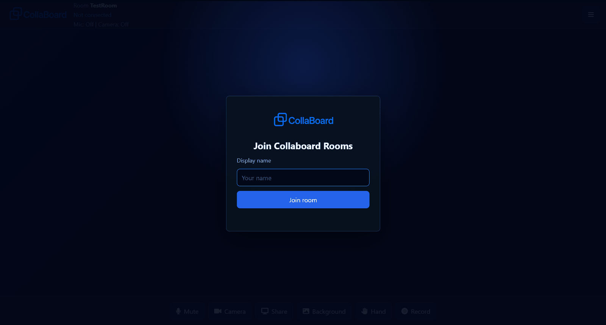
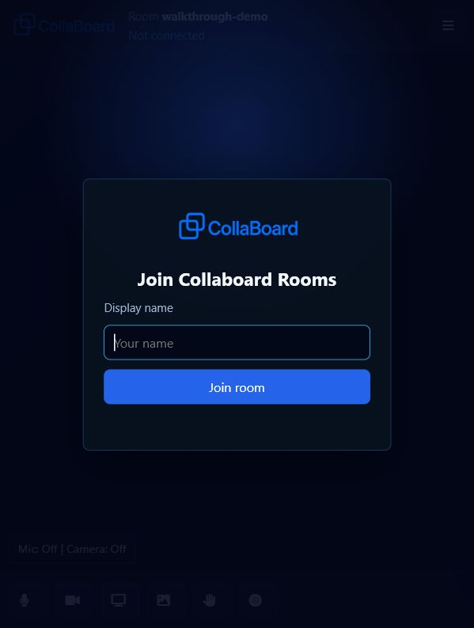
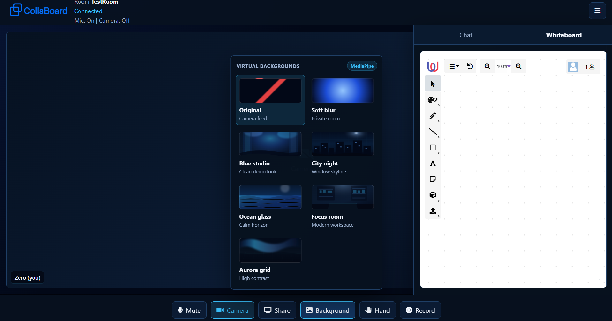

# Collaboard Rooms

Collaboard Rooms is a real-time video collaboration app built with ASP.NET Core SignalR, PeerJS/WebRTC, MediaPipe Selfie Segmentation, chat, screen sharing, local recording, and an embedded whiteboard. The app is designed to run as one full-stack web service on Render and uses PeerJS Cloud for WebRTC peer discovery.

## Live Demo

Production URL:

```text
https://collaboard-rooms.onrender.com/index.html#room=resume-demo
```

Render free services may take 30-60 seconds to wake up after inactivity.

## Features

- Room-based real-time messaging with ASP.NET Core SignalR.
- Peer-to-peer audio and video calls through PeerJS/WebRTC.
- PeerJS Cloud signaling with the default PeerJS client configuration.
- Chat with server-side room validation and message length limits.
- Camera, microphone, screen sharing, MediaPipe virtual backgrounds, raise-hand, and local recording controls.
- Five bundled blue/black background scenes plus a privacy blur option.
- Embedded whiteboard scoped to the current room.
- Responsive UI for desktop and mobile-sized screens.
- Docker-based deployment that works cleanly on Render.

## Screenshots







## Requirements

- .NET SDK 9.0 or newer for local development.
- A modern browser with WebRTC support.
- Camera and microphone permissions for video calls.
- A GitHub repository if deploying through Render.

## Local Development

```powershell
dotnet restore CollaboardRooms.csproj
dotnet run
```

Open the URL shown by `dotnet run`, then use a room URL such as:

```text
http://localhost:5281/index.html#room=team-demo
```

## Testing Calls

Use the same room link for every participant. The app connects people automatically after they enter a display name and allow camera and microphone access.

To test by yourself:

1. Open one room link in a normal browser window.
2. Open the same link in an incognito/private window, a second browser profile, or a phone.
3. Join with two different names.
4. Use the chat, mute, camera, MediaPipe background picker, screen share, raise-hand, recording, and whiteboard controls.

Some browsers only let one tab use the same camera at a time. If the second tab cannot access the camera, use your phone or another browser profile for the most reliable video test.

To test with someone else, send them the same room URL, for example:

```text
https://collaboard-rooms.onrender.com/index.html#room=resume-demo
```

If the Render service has been idle, the first load can take 30-60 seconds while the free instance wakes up.

## Troubleshooting

- If chat looks unavailable, use the top-right panel button to open the collaboration panel, then select the Chat tab.
- If a message does not send, wait until the room status changes to `Connected`, then try again.
- If virtual backgrounds do not start, make sure the browser has camera permission. MediaPipe needs an active camera track before it can replace the background.
- If the camera permission was blocked, reset the browser permission for the site, refresh the room, and join again.

## Free Deployment Plan

Recommended free stack:

- Render: full app hosting as a free web service.
- PeerJS Cloud: free WebRTC signaling used by the PeerJS default client.
- GitHub: source control and Render deployment source.

Render free web services can spin down after inactivity, so the first request after a quiet period may be slower. That is acceptable for a resume/demo project, but it is not production-grade hosting.

## Deploying To Render

1. Push this repository to GitHub.
2. Create a Render account and connect the GitHub repository.
3. Choose `New` -> `Blueprint` if Render detects `render.yaml`, or create a `Web Service`.
4. Use the Docker runtime.
5. Select the free plan.
6. Deploy.

The included `render.yaml` configures the app as a free Docker web service. The app reads Render's `PORT` environment variable automatically and exposes `/healthz` for Render health checks.

Use hash-based room links on Render to avoid provider routing issues with query strings:

```text
https://your-render-service.onrender.com/index.html#room=team-demo
```

## Security Notes

- Do not commit service keys, tokens, or deployment credentials.
- User-provided chat and labels are inserted with text APIs to avoid script injection.
- The hub derives room, peer, and username state from the connected client instead of trusting client-supplied room values for actions.
- Video background effect names are validated on the server before they are broadcast to other clients.
- MediaPipe runtime files and background images are served locally from `wwwroot` so camera frames do not need to be sent to a third-party background service.
- The app sends security headers, including a content security policy, `nosniff`, frame protection, referrer policy, and browser permission limits.
- Free PeerJS Cloud is convenient for demos. For a production app, use a private PeerServer with authentication and abuse controls.

## Verification

Useful checks before deploying:

```powershell
dotnet build CollaboardRooms.csproj
dotnet format CollaboardRooms.sln --verify-no-changes
dotnet list CollaboardRooms.csproj package --vulnerable --include-transitive --source https://api.nuget.org/v3/index.json
node --check wwwroot/js/rooms-app.js
node --check wwwroot/js/rooms-peer-connection.js
node --check wwwroot/js/rooms-video-controls.js
node --check wwwroot/js/rooms-ui-controls.js
node --check wwwroot/js/rooms-whiteboard.js
node --check wwwroot/js/rooms-chat.js
```
